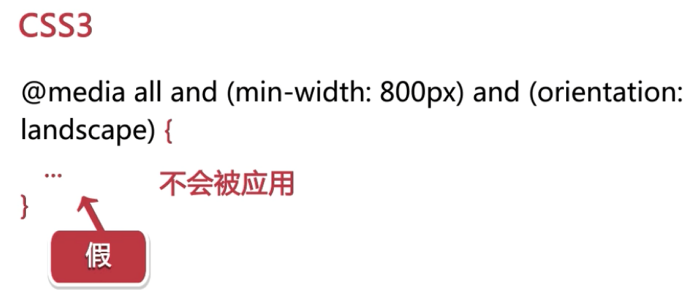
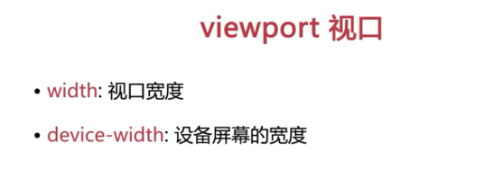
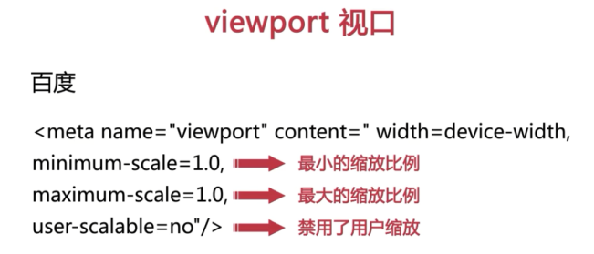
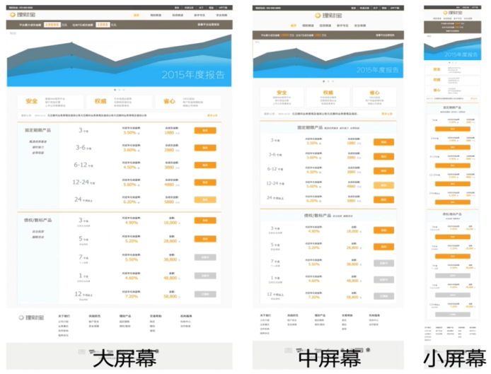
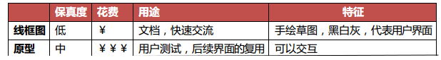

# 第1章 前期准备

## ★讲了什么

> 介绍了课程内容、背景和案例展示、什么是响应式网站、怎样分析设计图、响应式网站设计实践原则

## ★1-1 课程安排

1. 有主课程和拓展课程
2. 以案例为主线，把相关的知识点穿插到案例中！
3. 每个知识点学完后都会有相应的任务，总之学完一个知识点，得要有练习才行！
4. 前置知识：掌握比较基础的html、css、JavaScript即可！
5. 老师的讲课方式：比较细致

## ★1-2 课程简介

1. 看完这课后或多或少都会获得启发与收获！

2. 课程的主要脉络：通过一个实际案例来讲解相关的知识点，之所以这样讲是为了不让课程变得枯燥起来

3. 这个实际案例是由真实网站改编而来的，**✎：**

   1. 从0搭建，讲解其中要用的知识点以及可能遇到的问题
   2. 互联网金融P2P网站！——理财宝
      1. 页面有广告、产品等元素
   3. 所谓的互联网金融，就是把传统金融业务和互联网技术相结合来进行盈利！

4. 响应式的网站，在不同的分辨率下，都呈现出了不同的效果！总之就是页面的排版会发生变化！（注意这可不是减少1个px就会变化的啊！）

5. 通过这门课程，我到底能学到什么呢？

   其实，看目录基本上就能了解个大概了！

   总之，一图以蔽之，**✎：**

   

   解释一波，**✎：**

   1. 响应式网站这个概念是怎么来的，它有什么好处
   2. 从0开始构建的响应式网站，在这其中都涉及到了哪些知识，而这些知识又如何来应用呢？

   3. 你要知道你的姿势已过时，请解锁新姿势 :smirk:
   4. 还有围绕网站开发的其它知识等等……


## ★1-3 响应式网站设计的概念

### ◇什么是响应式网站？

在此之前，还是先看看这篇文章再说，**✎：**

**➹：**[Responsive Web Design · An A List Apart Article](https://alistapart.com/article/responsive-web-design)

文章比较长，而且是英文的，为了方便理解，所以就先看译文吧！，**✎：** :joy:

**➹：**[译言-响应式互联网设计](http://article.yeeyan.org/view/340229/299850)

摘录一些话，**✎：**

> 1. 互联网的短暂性，常常在一两年内就需要细化更改或取代。当我们发表作品时，需要和太多无形的变量 进行协商——视窗的尺寸、屏幕的分辨率、用户的个人定义、系统的自带字体，这些仅仅是其中的几个例子。
> 2. 我们常用子域名来把移动终端对网站的要求与那个“非移动网站”划分开来。但下一步呢？再加一个“iPad网站”？再加一个“诺基亚N90”网站？我们真的可以继续为每一个新的用户终端定量身定做吗？
> 3. 我们的弹性设计在以普通电脑显示屏为出发点的环境下能够游刃有余，但超出这个范围之外优化程度就很低了。
> 4. 近来一种叫“响应式建筑”的新兴专业正开始探讨实体空间应该如何对身处其间的人进行响应的问题。
> 5. 与其为特定的空间体验而创建不可变的空间，他们的建议是人和建筑能够并且应该相 互进行影响。同理，与其为越来越多不同的互联网设备量身定做一个个相互割裂的设计， 我们应该把这些设计需要当作同一个体验的不同层面来处理。

所以，**✎：**

> 我们应该推行响应式互联网设计

那么我们该如何开始呢？

1. [media types](http://www.w3.org/TR/CSS21/media.html)（针对各种特定的互联网终端设备）→☞[media queries](http://www.w3.org/TR/css3-mediaqueries/)（用以在媒介类别的基础上加以改善）

2. 下方这个例子的媒体查询的两部分，**✎：**

   1. 媒介类别——屏幕（screen），以及
   2. 括号中的查询内容，包括具体需要检验的媒介特性——最大设备宽度（max-device-width），以及紧跟其后的目标数值（480px）。

   ```html
   <link rel="stylesheet" type="text/css"
     media="screen and (max-device-width: 480px)"
     href="shetland.css" />
   ```

总之，**✎：**

> 一旦设备通过媒介查询的检验，相关的CSS样式表即施加到源码上。媒介查询简言之就是我们**设计师的条件注释**（[conditional comments](http://msdn.microsoft.com/en-us/library/ms537512%28VS.85%29.aspx)）。不同的是我们**并非针对某个浏览器的某个版本**，而是随着设计布局逐渐超越其初始的理想分辨率，对产生的问题进行**有意识的矫正**罢了。

### ◇总结一下响应式网站设计的一些概念

其实并没有什么官方的概念！简单的说，响应式设计是一种方法，它使网站可以在任何类型的设备，和任何尺寸的屏幕上，如从最小的手机一直到最宽大的大屏幕显示器，甚至是大屏幕电视投影之类的都可以轻松的浏览和使用！采用响应式设计呢？网站仅需要有一个版本你就能浏览全部的内容，而且网站会自己重新排列，用于完美地适配任何尺寸的屏幕！而且具有全尺寸的文本，你在手机里无须进行缩放，就能进行高效的操作！而在大屏幕的显示器中，你又无须忍受像蚂蚁一样小的蝇头小字，还有大片的空白。在不同设备中，网站展现出来不同的设计风格。


所以呢？有些人单纯地把响应式设计理解为弹性布局、自适应布局等等，这些都是不正确的！在作者2010年提出概念的时候就已经纠正了这种不正确了。

总之，**✎：**

> 响应式网站它是一个设计理念，它是多项技术的一个综合体

所以，会过头来看，这些就是响应式网站它的一些概念，**✎：**


那么响应式网站有什么优点呢？ :question: :question: :question:

## ★1-4 响应式网站的优点

响应式网站有什么样的优点呢？响应式网站主要有如下的一些优点，**✎：**

### ◇减少工作量

首先就是减少工作量，这是显而易见的也是最明显的优点，无论是网站、设计、代码还是内容，你都只需要创建一份，我们做这样一个假设，如果你的网站有一个单独维护的一个手机版站点，也就是移动版站点，那么你就需要创建和维护两套或者更多完全独立的html页面，还有其他它的一些代码，任何改动都需要对每个站点进行同步的修改，即便你试图让它们保持一致，在这个过程中由于人总是会出错的，所以也几乎肯定会出现一些问题。当然你也可以采取从后台生成或者获取一些内容，这会让这种同步看起来简单一些，但是也很难避免出问题。那么我们采用响应式设计，那么多出来的工作量，其实只是在脚本、样式上做一点点改动，这对于前端工程师来说是非常好的，而且对于这种招前端成本高又难招的一些现代企业来说，无疑也非常的具有诱惑力！

### ◇节省时间

减少工作量之后，其实它带来的显着效应就是节省时间。每个做企业尤其是做互联网企业的人都知道，人力的成本非常的高，但是**最高还是时间成本**，我们晚一天发布失去的不只是用户或者收入，可能我们机会甚至于公司的前途都随之失去，所以我们**迅速发布、快速迭代、敢于试错、小步快跑，一般来说都成为了互联网企业的基本理念**，所以采用响应式设计，我们可以缩短一点点的时间，提高一点点的用户体验，从而让企业离成功也更近一点点。

### ◇每个设备都能得到正确的设计

使用响应式设计呢？还有一个很具备说服力的理由，就是你创建网站，这个网站可以在现今市场上几乎任何设备都能够正确地好好地工作，更具有非常好的一个显示效果，不仅如此，很可能在未来出现的那些新设备上也具有一个很好的呈现，所以针对每个设备，响应式网站都可以让它得到一个 正确的设计，能够面向未来，这也是响应式网站的一个重要的优点。

### ◇搜索优化

采用响应式设计的一个网站，不管针对什么样的设备，同一个地址的url是相同的，不会出现像我们设计多套的时候出现的M或者Mobile之类打头的子域名，这也就是我们的搜索优化。谷歌自2012年以来开始推荐将响应式设计用于为智能手机优化的网站，不仅因为它能够创建一个更好的用户体验，还因为它允许谷歌的网站爬虫更有效的检索到你的内容，这意 味着所有对网站的一些改变将会很快的在搜索引擎的结果中得到更新，所以如果你根据不同的设备建立多套网站，那么搜索的优化比起响应式网站也会困难很多！

### ◇其它

当然响应式网站还有其他的很多优点，比如说更好的用户体验，更容易统计用户的来源等等，在这里就不一一说明了。

一图以蔽之，上面几点内容，**✎：**


### ◇响应式网站的缺点

那么说了这么多的优点，那么有没有缺点呢？当然也有。

比如响应式网站它会加载更多的样式或者脚本资源。

由于布局都是弹性的，作为设计师来说比较难精确的定位和控制，所以对设计师来说有更高的要求，而且对于老版本ie浏览器等等支持也不是很好，怎么说呢？ 其实这个世界上尤其是软件开发领域，它是没有银弹的，所谓银弹就是解决一切问题的终极方法——绝招、大杀器，也就是说一个技术的出现或者一个理念的出现，它总会有优点和缺点，有它适用的场景，我们只有**认真了解响应式这个网站它的概念，它的优点，它的缺点，它适用的场景，才能更好的决定我们怎么样来用，在什么情况下去用**。


## ★1-5 浏览器一览

### ◇需要掌握的技术

响应式网站开发都需要掌握哪些基础的技术，其实只要你有基本的html 、CSS和JavaScript知识，我们就可以开始响应式网站的开发了，其中所需要的关键知识在这门课程中都会一一提到。


### ◇有哪些浏览器呢？

再开始下一节之前，我们先来熟悉一下浏览器，为什么我们要熟悉浏览器呢？

作为一个前端开发人员开发的网站总是需要在浏览器上去显示的，所以知道有哪些浏览器、它们的版本和大概的用户量是非常重要的，我们没有精力也没有必要去兼容所有的浏览器它们的所有版本，因为一旦你兼容了某种浏览器的某个版本，就意味着你的每一次版本每一个发布都可能需要花费人力或者物力在它的上面去做测试，而且对它做兼容性的处理。

**在浏览器和版本的兼容性和工作量上去做取舍，这是网站的关键角色之一**，比如现在windows phone它所占的市场份额可能很小，那么是否兼容windows phone，你就要想一想同样的是否兼容ie8及以下版本的ie浏览器也是需要考虑的问题。


### ◇can i use？

在考虑哪些浏览器和版本的兼容性这些问题之前，我们先来看几个浏览器的统计，**✎：**

**➹：**["Can I use" usage table](https://caniuse.com/usage-table)

左边起第一栏是IE浏览器，IE从12的版本开始叫做Edge！

从第7栏开始都是些移动端的浏览器了！

还有其它一些浏览器，总之该网站罗列出来的这些浏览器的占比量为96.21%，还有就是，这些颜色亮一点的表示，占比比较大的，**✎：**


对了，这个统计是面向全世界的！可能没有为我们中国这个特定的国家做一些统计。

### ◇statcounter？

这也是一个全球的一个浏览器的统计的网站。但是相较于caniuse可以选择特定区域的统计！如选择中国区域，**✎：**

[Browser Market Share China —— StatCounter Global Stats](http://gs.statcounter.com/browser-market-share/all/china/#monthly-201708-201808)


可见谷歌浏览器所占的比例非常的大，而且是在逐渐的升高。总之2个人中，1个人是用chrome浏览器的！:joy:

对了，你还得去分析一下IE的占比，可见很平稳！可是，为什么要分析IE的呢？

其实很多兼容性问题往往都是ie所造成的兼容性问题，如我们是否决定兼容IE8？是否决定兼容IE9？

由于IE9以后的ie版本它的兼容性问题比之前的版本要少很多，所以我们有没有必要为这种10%以下的用户去做兼容呢？而且由于360它的用户代理的问题，其实**很大一部分使用360浏览器的用户他会被作为ie浏览器来统计**，因为360其实有两种内核，**✎：**

1. 一种急速它是用了webkit的内核
2. 另外一种它用了本机IE的一些内核，那就得看你本机IE的一个版本了

从趋势和份额来看，在国内PC浏览器其实IE的份额是逐渐下降的，而且第三方的浏览器也占据了很大的市场，如搜狗、360、QQ等等的。其中 有一个大家需要注意的就是移动版的QQ浏览器有一个很有意思的地方，虽然它的用户量可能不及其他的比如说原生浏览器、uc浏览器等等的，但是我们所用**微信它的内核采用了QQ浏览器的内核，也就是同样的X5内核**，**✎：**

**➹：**[腾讯浏览服务](https://x5.tencent.com/tbs/index.html)

有兴趣就可以来看一看腾讯的X5浏览服务这样一个产品，有时候我们做一些手机开发的时候，它调用了系统的webview ，但是由于安卓系统它各个版本的差别特别大，甚至于有一些版本，比如说三星低端的一些手机，它的原生浏览器的表现甚至于和webview 不一致，所以如果我们要简单的做一些兼容，可以用X5这样一个浏览服务来替换系统的webview ，当然这是后话了。

### ◇小结

总的来说浏览器的兼容性是响应式网站开发重要的一个考量因素。因为**兼容性是 一个很大的课题**，我们这门课程主要是聊响应式网站开发它的相关技术，而不是兼容性的相关技术，所以我们**这门课程主要是在chrome，也就是谷歌浏览器上进行调试**。关于其它的浏览器的兼容性问题和调试，后面会提到。**现在的浏览器其实对于Web标准的支持都变得越来越好了**，包括ie，包括其它的各种版本的浏览器，很多国产的这些浏览器也都用了比较现代的，比如说Webkit之类的内核，它们的表现其实兼容性都很好，相信**未来兼容性问题对我们前端开发人员的影响一定会越来越小**。

## ★1-6 媒体查询-1

### ◇CSS2时代

我们来单独说一说媒体查询，媒体查询早在CSS2就有了，下面这两句话就是典型的媒体查询，**✎：**


那时候的媒体查询比较初级，也比较简单，其实**主要就是用来区分一下我们是在屏幕显示或者是打印**。其中加粗的两句话（引入样式表）大家都非常熟悉。

### ◇CSS3时代

在CSS3中媒体查询被进一步增强了，它包含了很多**媒体类型和函数**，**允许我们在样式表中更精确的匹配一些显示规则**。


这样一句就是一句典型的媒体查询，**✎：**


解释一波，**✎：**

#### 媒体查询和媒体类型

前面开头用`@media`代表这样一句话是媒体查询；`all`是媒体类型。这样一段花括号内省略号省略了一些样式，这样一段样式应用于**所有**的媒体类型。

当然我们也可以使用`screen`、 `print`，也就是屏幕、打印之类的媒体类型。**✎：**


**媒体类型是可选的**，也就是说这个`all`你可以不写，如果不写的话，默认就是为`all`，就是全部。

当然如果使用`not`或者`only`之类的操作符，这个媒体类型就必须得写。not、only这些操作符等会我们会讲到。


#### 表达式

接下来就是一堆表达式。我们看and后面连接了一个括号内的表达式，然后再and再连接了一对表达式，我们先不去管这个表达式里边的内容代表什么样的含义。

#### and

我们先看这个and，大家都知道它是一个逻辑的操作符，在媒体查询中，我们可以用not、and和only之类的逻辑操作的一个查询符来去连接。**✎：**


这个and，就起到**连接**的作用。其实**媒体查询也就是这样一段媒体表达式**，它就是对这些操作符它所连接的这些表达式进行一个统一的计算，and、and计算完了，就返回一个布尔值，也就是真或者假。**✎：**


如果这样一句话一整句媒体查询，它代表着真，那么 我们接下来省略号里边的样式就会被应用，**✎：**


如果这样一句话代表的是假，我们省略号里边的这些样式就不会被应用，**✎：**



所以这是一段逻辑操作的一个连接。

#### 逗号、or

当然我们的and、也可以不光是not，only， 我们也可以用逗号，用逗号代表什么意思呢？用逗号分隔，其实**效果等同于or**，**✎：**


#### not

and、or这两种大家都比较清楚了，是两种逻辑的操作符，一个是与，一个是或。与和或都很好理解，一个是全部都要匹配，一个是任意条件匹配一个就可以了。那么not是什么意思呢？**✎：**


**not的话一般应用于一个整个的一个媒体查询，代表非**，也就是后面的这些媒体查询的一个否定。如果后面这些媒体查询它不成立，那么加上否定就代表成立。大家要注意，not后面跟的这样一段是括起来的，其中这样来写等价于在后面这样一段话中加上了括号。**✎：**


但是如果**中间出现逗号来分隔**的话，也就是刚才我们说的逗号等价于or，那么not后面这样一段话，就只管到逗号这样一个位置，这是需要注意的，也就是说，你**加了not它有效的范围只是到逗号**，如果逗号后面还想要使用not就接着增加not来写！**✎：**


#### only

介绍完前面三个逻辑操作符，那最后一个only这个关键字会**复杂一些**，**✎：**


only是什么意思呢？英文大家都知道，就是「仅仅、只有」，它主要是**防止老旧的浏览器不支持带媒体属性的查询，而应用到给定的样式**。**✎：**


怎样理解？

我们来看这样两句话（下图），第一句话有only，而第二句话没有。

其实它们的含义都是一样的，就是仅仅是在屏幕显示中，然后包含这样两个条件，如果达到的话应用这样一个样式。但是在比较老的浏览器中，如果**这个老的浏览器它不支持媒体查询**，它会在第一个空格处把后面的文字都给忽略掉，只会解释到第一个单词only。也就是说在老浏览器中第一句话会解释为下面这样一个加粗的`media="only"`，而下面这句话会解释成`media="screen"`，所以**第一段样式 老浏览器是不会应用的**，因为**没有一个叫only的这样一个设备**，所以老浏览器会忽略掉。而第二段话如果被老浏览器解释成了`media="screen"`，也就不管后面你的媒体查询怎么样来写，对于老的浏览器来说都会应用这样一段样式。因为它已经把后面的逻辑表达式给忽略掉，它**永远为真**。


所以我们要注意，一般来说，当我们**只针对某一个设备去应用媒体查询的话，最好要带上only，除非你确定你根本就不需要兼容老的浏览器。**


### ◇CSS3 媒体属性简介

CSS3提供了很多的**媒体属性**，用来让我们**精确的应用和匹配规则**。


这里简单介绍一下主要的媒体属性，主要的媒体属性有宽度、高度。这个宽度、高度是视口的宽度和视口的高度，这里视口，大家可能有些人会比较陌生，等会我们会说到，我们先留一个扣子。

#### 有哪些CSS3 媒体属性？

我们来看一下设备的宽度，这是代表渲染表面的宽度，官方的定义是渲染表面的宽度，对我们来说就是设备屏幕的宽度，下面也就是设备的高度，在下面是检查设备是处于横向还是纵向。**✎：**


接下来是基于视口的宽度和高度的一个宽高比，比如我们的设备它是16:9还是4:3。在最后是每种颜色的位数，可能我们有些屏幕它的颜色是16位，有些可能只有8位或者更低。根据颜色位数的不同，我们可以决定显示哪些颜色，最后还有检测屏幕或者打印机的分辨率，比如说我们是300dpi，这是一个分辨率的一个精度。**✎：**


当然**还有很多其它的一些属性，大家可以去查阅官方的文档**。

#### 常用的CSS3 媒体属性


最主要我们最常用的就是最上面这样四个属性，也是这样四个媒体属性。

当然对于上面的属性我们都可以添加前缀，而且经常我们使用的都是添加前缀后的这样一些媒体属性。比如我们可以添加最小或者最大这样一个前缀。**✎：**


## ★1-7 媒体查询-2

### ◇viewport视口

我们要注意一下视口宽度和设备宽度的区别。**✎：**


刚才我们讲到width和device-width，一个是指视口的宽度，一个是指设备的宽度，由于屏幕的不同和设备的多样化，这两个宽度往往不一样。**✎：**



在这里我们主要来介绍一下视口viewport的这样一个概念。**✎：**


其实在只有桌面浏览器的时候，桌面的浏览器只有一个视口，**✎：**


这个视口就是浏览器主窗口的区域，显示网页内容的区域。**✎：**


但是到了手机浏览器，**✎：**


这时候却有了三个视口的概念，第一个叫布局视口，第二个叫可视视口，第三个叫理想视口。听到这里，大家是不是感觉非常的懵逼？**✎：**


### ◇一个例子，让你明白布局视口和可视视口

其实我们在chrome浏览器的移动设备调试工具下来看一个网页，我们就明白了。

**➹：**[Viewport - Wikipedia](https://en.m.wikipedia.org/wiki/Viewport)

这是一个wiki的网页，为什么我们要出现三个视口的概念呢？为什么不能只有一个视口？而这个视口就是窗口区域大小呢！

#### 历史原因

其实这个原因要从智能手机时代刚开始说起。在手机出现以后，我们的乔布斯帮主发现一个手机浏览器上非常重要的问题，那就是**其实我们的很多网页都是针对pc端来设计的**，在手机上要想看这些网页，iPhone刚出的时候分辨率更小，**宽度只有320像素**。那么我们为PC制作的这些网页，最起码宽度也得有**960像素以上**，**在小屏幕上显示这些页面，会让页面非常难以查看，体验很差**。

这怎么办呢？其实解决的办法出来了，乔帮主是这样的，我**引入一个布局视口的概念**，这个布局视口，就相当于我**在手机上我先不显示**，我先**在一个虚拟的这样一个布局视口中把这个桌面端的页面显示出来**，这个视口宽度怎么样呢？我**一般把它的宽度设为960像素或者等等**吧！

#### 例子

我们来打开chrome浏览器的这个手机调试，打开以后我们选一款手机，比如iPhone5，我来模拟一下这样一个渲染的过程。右上角代表这个网页的放大倍数，我们先把它改成1。在这个手机屏幕上渲染维基这样一个页面的时候，我们会先把这个宽度作为960像素，上面是像素的显示，作为960像素的宽度来把页面虚拟的渲染出来。**✎：**


虚拟的渲染出来之后，我们会**缩小这样一个页面，以至于它可以 在手机的浏览器中整个的显示出来**，就是我们刚才所看到的。我们点击了iPhone4或者iPhone5，这个页面会被缩放，缩放成0.3倍，显示在手机页面中。这个时候一个960宽的页面就会在320宽的一个手机设备中被显示出来。**✎：**

旁白：这时的布局视口就是等于可视视口的啊！都是960px！


当然我们可以通过滑动或者放大来显示网页的不同部分，我们可以放大，这样的话在手机上操作，是通过两个手指头的这样一个放大的手势，来放大网页的不 同部分。**✎：**


这样的话，第二个视口的概念就可以引入进来了。**✎：**


第一个视口刚才说过，它叫布局视口，是我们一开始用一个虚拟的960的宽度来把网页先布局出来。

第二个视口叫做可视视口，也就是我这样一个网页在手机上呈现出来的这样一片区域它的一个宽度，这个区域的大小就叫做可视视口。**✎：**


注意**用户的缩放会改变可视视口的大小。缩放是不会改变布局视口的大小的，也就是布局视口在这个窗口中，它永远都是960**。**✎：**


我们在缩放中，这一片深灰色的区域，它的宽度是不会变的，但是同样的刻度，在同样的手机的320宽度下，它代表的是不一样的，也就是可视视口的宽度是在不断的改变，**✎：**


上面的标尺，丈量的这样一段区域是可视视口的宽度。

那么对于可视视口，**开发者一般只需要知道它的存在和概念就可以了**。因为我们没有办法对它进行任何的设置或者修改，它是用户自己在进行缩放啊、拖动之类的操作来修改的。所以**很明显，可视视口它的尺寸也不会是一个固定的值**，随着用户的缩放，可视视口是不断地在改变的，每款设备可能都不同。

## ★1-8 媒体查询-3

### ◇一个比喻，一个理解

结合布局视口和可视视口，我们可以看出来用户在手机浏览器上查看网页的过程，其实就是缩放和滑动可视视口来显示布局视口不同部分的内容，这个有点像我们使用放大镜来看书，书相当于布局视口，它的宽度是不变的，放大镜相当于可视视口，我们调整放大镜到书的距离会改变我们可以看到内容的数量，这个就相当于我们缩放页面，我们移动放大镜可以看到书上不同的内容，这相当于我们滑动页面。

### ◇为什么需要第三个视口？

这两个视口似乎很好地解决了显示页面的一个问题，可为什么还有第三个视口呢？

我们再想一想就会意识到问题的所在。

布局视口默认宽度都比较大，**一般都在960像素或者更高**，而**可视视口默认宽度就是屏幕的宽度**，也就是我们手机设备屏幕设备的宽度，这就导致了用户在查看页面的时候，需要通过缩放和滑动页面来查看页面的不同部分，这虽然很好地解决了我们显示为桌面浏览器做的一些网站，但是体验并不是很好，我们就好像把手机当作一个放大镜，再去放大的照着去显示一个桌面版的网页一样。

那么为了设计并构建出来更适合在手机浏览器上查看的页面，又引入了一个概念叫做理想视口。

### ◇理想视口出现了

理想视口其实是指布局视口在一个设备上的**最佳尺寸**。

理想视口下的页面，它具有**便于浏览器浏览、阅读**的这样一个最佳的宽度，我们不需要缩放就可以很好地去查看页面。**✎：**


这个理想视口，它从概念上有点类似于布局视口，我们**不按照960来布局，按照理想视口来布局**，这个页面看起来**不需要缩放，就很方便**，但它的**宽度又和可视视口相同**，因为我们不需要缩放，肯定理想视口它的宽度，最好是和可视视口，也就是最好与我们设备的宽度一模一样，所以这个理想视口就是为构建手机浏览器优化的页面而添加的。**✎：**


一般来说也只有为手机浏览器优化过的页面，它才会使用理想视口。

### ◇怎么使用理想视口？


怎么使用理想视口呢？我们需要通过在页面上添加下面的元标签，代表视口元标签，**✎：**


也就是这个元标签的`name`等于`viewport`，而它的内容有这样一句——**它的宽度等于设备的宽度**。上面这句话告诉手机我要使用理想视口，这个理想视口，它的宽度，它要作为布局视口的宽度，这里边的`width`被用来定义布局视口的宽度。如果不指定该属性，比如说我们把这句话不写，**✎：**


那么**布局视口的宽度就是厂商的默认值，比如960像素宽度或者980或者其他的**；

那么如果当我们**用这句话设置以后，这时候布局视口将成为理想视口**，**✎：**


**布局视口的宽度和设备可视视口的宽度一致了，那么这个布局视口就是理想视口了**，**这个页面默认的布局的宽度就是设备的宽度**，那这个页面的展示就非常理想了，即我不需要再缩放就可以把整个页面展示出来了，这个一致之后两个宽度之间的差异消除了，我们就可以直接针对理想视口的宽度来进行响应式设计，用户不需要缩放就有很好的体验，这样非常好，甚至于很多网站就直接禁用了用户的缩放，把默认的放大倍数设置为1，**✎：**


比如说下面这样一句话，这就是百度的网站，**✎：**


它在这里不仅让这两个宽度保持了一致，而且还设置了最小的缩放比例、最大的缩放比例都为1，然后禁用了用户缩放。**✎：**




刚才说了很长一段都是在讨论视口这样一个概念，因为**这样一个概念稍微有一点难理解**。

说到这里，如果你还没有理解，没有关系，其实**很多人对这个概念理解都非常的模糊**，你可以**重新的听几遍刚才的内容**，或者**多看一些相关的文章**，或者**如果你根本就不想理解这个概念，其实也没有什么关系**。你就简单的记住，**在响应式网站中默认设置一下`viewport`这样一个元标签就对了**，也就是说在响应式网站中，你**最起码要有这样一句，`width=device-width`**，**✎：**


后面你可以设置视口的其它的一些属性。

其它的一些属性，包含一些用户默认缩放的比例，最大最小缩放的比例，是否禁用用户缩放等等，你可以设置也可以不设置。

以上就是视口的这么一个概念。

## ★1-9 怎样分析设计图

### ◇网站开发前的工作

一般来说在网站开发之前都会有一些其它的工作要做，比如需求调研、原型设计、UI设计、评审等等。

我们为什么要做这样一个网站？这个网站它要解决什么样的问题？网站的受众有哪些？网站想呈现什么样的东西？这些东西如何来组织？交互的逻辑是怎样的？如何展现？等等都不需要我们前端工程师来做。


我们的事情很简单，就是根据需求和设计图来实现页面的效果。

那么我们现在就来讲一讲，当我们拿到设计图之后，我们需要怎么样来做？做哪些事情？

### ◇怎样分析设计图？

首先我们要和UI或者UE设计师，还有产品经理进行仔细的交流，要看一看需求在设计图中是否都有所体现？各个地方是如何交互的？

有没有相应的设计规范和规则？比如说字体、颜色、大小、行距、边距、间距等等，它们有哪些默认的设置和规范？

前端和设计师的合作非常的重要，其中换位思考也非常重要，设计师他们往往追求极致的效果，而前端开发工程师他需要去考量实现的复杂度，设计图中哪些需要原封不动还原，哪些可以有宽容度等等，这些我们都要好好的沟通。

一般来说，响应式网站由于弹性布局居多，在设计图实现的过程中都会有较大的宽容度，毕竟设计师无法去模拟所有分辨率去给出精确的设计，哪些需要宽度自适应，哪些需要去绝对的定位，需要具有绝对的一个尺寸，这些设计师都会去做一些考量。


### ◇讲师建议

其实我建议一个公司它的设计师最好有一些前端开发的功底。

当然前端开发最好也要有基本的设计的能力。

这样的话双方沟通起来会更加的方便、顺畅。

我接下来就不再接着说沟通了，再接着说就有一些鸡汤的性质了，大家在实际过 程中，自己去体会去磨合就可以！


### ◇分析设计图的结构

#### 变与不变

接着我们拿到设计图就是分析一下设计图的结构，在这里我们有三张页面的设计图，分别对应了三类分辨率下设备的呈现效果，大屏幕、中屏幕和小屏幕。**✎：**



这里的大屏幕主要是面向pc和平板用户，

中屏幕主要面向小平板用户和大屏手机用户，

小屏幕主要面向移动用户。

**✎：**


这里的设计图更像是一个最终的效果图。

关于**设计图的布局细节**，比如说准确的颜色！间距是14个像素还是15个像素等等，我们在这个案例中不会去过于的纠结，因为我们主要是来看响应式网站的一个技术实现，而不是精确的实现设计图的效果，所以在这个案例过程中，我们不会去纠结这些细节。

拿到设计图，我们要知道这个页面大体的结构是什么样的，哪些地方是可变的，就是刚才我所说到的、设计师权衡的，比如说这样一个大屏幕的设计图中间的4列，**✎：**


它们是可变的，它们根据屏幕的大小，它会相应地进行缩放，那哪些地方是不变的呢？比如说logo的大小，**✎：**


这张图片就是固定的一个宽度和高度，它是不随着屏幕的变化而变化的，无非它只是一个位置的改变。

其实从设计图上可以看出来，这个设计图来说，它可以改变的地方非常的多，它不变的地方比较的少。那么分析完哪些地方是不变的呢？哪些地方是可变的呢？**✎：**


#### 分析结构

我们来看一下它的一个大体的结构，为什么要分析结构呢？

分析结构，我们可以更有利于我们页面代码的一个层次组织。一个好的结构可以让网页的代码更加清晰，也可以有利于今后我们采用一些比如说SSI、模板渲染等等的技术，让某一些地方可以复用。

我们来看这样三张设计图中，其实页面的头部地区、广告区域、产品展示区域、底部导航区域、版权区域等，**✎：**


其实通过设计图来说就可以把它给区分开了。

在这里边，我们的「头部导航」和「底部的版权和导航」应该来说在每个页面都会出现，它是属于固定不变的部分，它可以去复用。

我们把结构拆分成这样几大块的话，就更利于我们在做网站的过程中实现一些代码的复用等等。如果我们没有把整个页面的结构拆好，比如说我们把这个广告和顶部的导航放在了一起，这样的话我们上面这一块将无法在子页面中进行复用。

#### 分析布局

结构分析完毕之后，我们可以来分析布局。**✎：**


布局是什么呢？

布局就是看看每一个结构部分中它的细节，它的元素如何排列，它适合于我们使用什么样的一些html元素去展现，这些元素如何排版和定位等等。

在这三张设计图中，我们可以看到几乎每个区域都有一些响应式设计在里边，比如说我们的顶部导航在大屏幕下是横向排列的，而在较小的屏幕下，如中屏幕下，其是logo摆在了最中央，而导航文字放在了logo的下面，在最小的屏幕下面，我们甚至于最顶部的一些菜单就自动的被隐藏掉了，比如说我们的「理财热线」就没有显示了，我们右边的一些「关于帮助」也自动的隐藏！**✎：**


分析完上面这些，基本上我们对设计图已经理解得很深了。

### ◇切图

那么最后一步就是切图了，切图可以由前端实现，也可以由设计师实现，不同公司可能会有所不同。

设计师实现的话可能会不清楚哪些图片该切？哪些图片不该切？也不清楚应该切成什么样的格式比较好。

那么前端切图呢？需要掌握一些ps或者sketch之类软件的操作，不过一般来说我建议前端自己来切图，**✎：**


这样对图片的控制更能精确，贴近自己的实现。

那么关于如何切图？如何选择图片格式？这些各有什么利弊？等等，在最后的补充课程里，我会专门说到，那么怎样分析设计图呢？我们就说这么多。


## ★1-10 响应式网站设计实践原则

了解了如何分析设计图，接下来我们聊一聊响应式网站它的设计实践原则！

### ◇渐进增强和优雅降级

#### 概念

首先我们介绍两个名词，渐进增强和优雅降级。**✎：**


这两个名词主要是针对**用户体验**来说的，它们是用于网站设计，尤其是**响应式网站设计**。

简单来说，渐进增强就是我们先构建一个**非常简单的**基本效果，再根据不同浏览器、不同分辨率等等的特点，**逐渐地追加新功能**，比如加个圆角、加个阴影，弄个动画蹦来跳去等等。

而优雅降级正好相反，我们先弄到一个**最终最漂亮的**状态，然后哪些浏览器没有哪些功能，我们就要**去掉哪些效果，逐渐的降级**！

#### 出现的原因

为什么会有这两个概念呢？其实是基于一种假设，也就是我们想要网站**在任何环境下面看起来都是保持一致的**，然而**这是不可能的**，不管我们为此付出多少努力，结局基本上都会令你失望，所以我们要**让老的浏览器可以用，而让新的浏览器体验更好**，这是一般通长来说的解决方法！

#### 观点间的碰撞——推荐优雅降级

一般的观点认为渐进增强是开发网站的最佳实践，因为以前的观念都是认为**以可用性优先**，网站先要是可用的，其次再要是好看的！

不过这个评价的标准，在我看来已经不太适用了，现在，在实际实践中，**渐进增强往往实行起来会比较反人类**，比如你想象一下，你先去花大部分精力在IE的老版本浏览器中实现一个自己看着觉得都想吐的一个简陋的网站，然后再针对chrome等现代浏览器一点一点地加上漂亮的效果，这个过程非常的苦逼，也有可能那个简陋的网站，你刚实现好，项目就解散了，更何况现在大部分人都是用移动终端，而**移动终端就无所谓一些老版本的兼容性问题**了，这个兼容性问题就会少一些。

所以我个人更喜欢优雅降级的解决方案，即先做一些有成就的事情，让它在比较新的设备上看起来非常的漂亮，非常的好看，然后再针对老旧的浏览器进行修修补补，至于到后期可能对于IE8、IE9可能就不支持了，或者直接写一句——「你的浏览器版本太老了，老的简直可笑」、「可以直接点击链接进行更新，更新到最新版本」，「告诉那些人你需要换浏览器」，甚至于我们可以告诉老板——那些使用老旧浏览器的人根本就不是我们的目标客户，他们可能占比连10%都不到，5%以下。所以在实际实践中我更推荐于优雅降级！**✎：**


### ◇小头屏幕？大头屏幕？

那么我们紧接着说下一个概念，这个概念就是我们应该先针对小屏幕进行设计呢？还是先针对大屏幕进行设计呢？**✎：**


#### 先选谁好呢？

有一类人他们的观点是，我们应该先针对小屏幕也就是移动设备进行设计，然后逐步增强针对大屏幕的设计和内容。

然后还有一部分人持有相反的观点，这又是一个比较纠结的问题。其实我觉得这个和**个人习惯有关**，也和**实际网站的性质有关**。**✎：**


我本人来说一般是**针对受众比较多的设备先设计**，比如说P2P网站，一般来说像我们这个P2P平台涉及到大额的支付，大部分人他会用pc，因为毕竟**大额的支付用pc还是会可靠一些**，它会有一些证书等等的，所以这个案例我就会**针对大屏幕先来设计和实现，然后再逐步利用媒体查询针对小屏幕进行实现**。

那有一些网站可能移动端的用户比较多，占到百分之七八十，这时候你就可以先针对小屏幕进行设计，上面所说的选择其实都没有所谓对错，可以**根据个人的喜好或者团队的习惯进行任意的选择**。

### ◇话说，我们用张三浏览器好了？

#### 你要兼容的浏览器

接着就是确定支持的浏览器。之前也说过，有一些浏览器它们的占比是怎么样的，它们在国内的占比，在全球上的一个占比。

我们需要根据**浏览器的占比**和**公司的前端资源**的一个情况来选择最合适的浏览器。

如果是一个新型的创业公司，我个人的建议是对于PC端来说，保证**最新一两个版本**的谷歌浏览器，也就是**chrome**，还有火狐浏览器，也就是**firefox**，还有ie的兼容基本上就差不多了，可能你兼顾到Safari也可以。

那么对于移动端来说，我们只需要保证**比较新的安卓系统自带的浏览器**，IOS系统自带的浏览器，还有qq浏览器，uc浏览器等等的兼容就可以了。当然这也根据产品的性质来决定，如看你的目标人群。**✎：**


#### 选择一个浏览器开始

不过我们不可能同时的去开展工作，一般来说，我们总要**选择一个浏览器先开始**，也就是说我们先在一个浏览器上把这个网页给**调试通过**。

一般的实践来说，我的建议是现在最新版本的chrome上也就是谷歌浏览器上**针对各个分辨率去进行调试**。这有哪些原因呢？

首先谷歌浏览器的**开发者工具非常的好用**，它看起来比较简洁，而且功能很多，功能还非常的**容易上手**，而且谷歌浏览器调试通过以后，除了**ie和其它一些比较小众的浏览器**之外，**大部分浏览器的表现都不会相差太多**，可能你需要做一些**修修补补的工作**就可以完成了，所以我建议**使用谷歌浏览器来调试和实现网站的第一个版本**。

当然还有一个最重要的原因就是谷歌浏览器的用户量非常大，占50%甚至更多，如果时间紧迫，需要马上发布，那么第一个版本，显然谷歌浏览器是最佳的选择。

当然，很多人也喜欢使用火狐，也就是firefox。

火狐浏览器当然也很好，我以前的课程中也讲过firebug的一些使用！新版本的火狐浏览器自带的开发者工具也非常的好用，甚至于**很多功能比谷歌浏览器要强**，所以还是刚才那句话，**看你的团队和习惯，最先支持的浏览器可以在谷歌浏览器或者火狐浏览器中任选其一**，不过火狐浏览器的用户量要比谷歌浏览器的用户量要小，这个大家需要注意，但是如果第一个版本先使用IE、Opera或者Safari等等浏览器进行调试，那么我就不是非常的推荐了，除非你是非常在意IE下的表现，因为毕竟这个调试的工作和调试的工具相对来说都会差一些。**✎：**


### ◇内容，你在乎设备大小吗？

接下来又该出现两派观点的碰撞了。

让我们来看一看这两个有意思的观点，

第一个观点是不管设备大小应该包含相同的内容。

第二个观点就是根据设备的大小不同，我们显示的内容也有所不同。**✎：**


应该包含相同的内容，还是不应该包含相同的内容，听起来其实都挺有道理的！

我觉得其实这两派的观点的分歧，**必要性不是很大**，这个**由产品经理来决定**就可以了。咱们前端其实不用去想太多这方面的问题。

如果**所有的内容都非常的重要**，我们就可以包含相同的内容，只是**布局和排版有所不同即可**；如果**有一些内容，完全没有必要在移动端去显示**，举个例子来说，我们已经在移动APP中打开这个页面了，这个页面上面假如说有一个链接是「下载APP」，**那就完全没有必要显示出来了。**

### ◇断点？debugger？逗我？

最后一个也是最重要的一个概念，那就是断点了。

先来说说什么是断点？

**断点就是媒体查询中的临界点**，一般来说媒体查询最常用的属性就是**宽度**，我们最常设置的就是**最大宽度或者最小宽度**。而宽度数值的选择决定了我们响应式设计的**分界点**，这个**宽度的数值就是我们所说的断点**。

对于响应式网站开发来说，断点的选择各有不同，很多人喜欢针对不同的设备来选择断点，比如我针对iPhone4或者iPhone5来选择相应的断点，下面这个例子就是很多做响应式布局的开发人员喜欢用的这样一个断点的设置，比如说我们用320和480，320和568这样一些标准的条件，来去确定这个设备到底是iPhone4还是iPhone5等等，但是在这里我是强烈反对这种做法的，**✎：**


正确的做法是什么呢？

正确的做法是我们不要针对这种特定的设备来进行这种样式的选择，除非你是需要针对iPhone某一个型号来对某一个地方进行优化，如果不是这样的话，千万不要针对特定的设备去做选择，而是要针对屏幕的大小进行分割，也就是说我们要把屏幕分成一些类型，比如说宽度小于480像素的，这种类型，我们把它叫做小屏幕，不管你这个小屏幕可能是iPhone可能是小米，可能是华为等等的一些手机的品牌，只要它的**宽度小于480像素**，它都是**小屏幕**这一类，

然后我们可以把**481像素到800像素**分成**中等的屏幕**，

把8**01到1400像素分为大屏幕**，

如果**1400像素以上**，我们可以管它叫**巨屏幕**或者等等，这样的话才是比较好的断点的设置方法，当然上面的值，这个480、800、1400等等只是一个例子。

**具体断点的选择**，我们还需要根据**设计师和产品的理解来确定**，我们只需要**领会这种设置断点的这种精神即可**。 **✎：**


好了，关于响应式网站设计的实践原则，我就说这么些。

### ◇我们的案例？

那么我们的案例采用什么样实践的原则呢？在这里我会采用**优雅降级**的方式，先针对**大屏幕**进行设计和开发，然后针对**谷歌浏览器**来实现我们的第一个版本。

在不同设备中显示的内容，我会按照**480和800像素**来确定断点，就是这些，那我们继续吧！

## ★小结

- 响应式互联网设计出现缘由——为啥你们总喜欢在移动端设备浏览页面？难道要为不同的设备搞一个新的页面，新的url？这岂不是累死大爷了啊！也忒他妈繁琐了吧！

- 自适应和响应式可不是一个概念，DOM元素天生就是自适应的！

- 你说你弄个弹性布局就是响应式网站？逗我吧！响应式网站可是一个设计理念哦！它是多项技术的综合体哦！你这个弹性布局的网站，没有用到媒体查询吧！没有用到[弹性图片](http://unstoppablerobotninja.com/entry/fluid-images)吧！没有想过换个尺寸看起来就会有点挫吧！

- 响应式网站有优点，也有缺点！总之不要什么一上来就搞响应式！你得根据需求去权衡！

- 由于IE的占比率已经少于10%了，具体一点是3.48%，所以并不需要去考虑IE的兼容性问题！

- 兼容性也是一个很大的课题，不过我还是直接使用最新版的chrome就好了！只要chrome已经支持的特性，不用管其它浏览器是否支持，直接用上！总之先把流程跑通，再去管那些细节！对了，偶然经常性的会看到在微信内置的浏览器里打开网页的时候，会提示你用chrome浏览器打开！

- 有媒体查询（包含有媒体类型、操作符、表达式等）、媒体属性这两个家伙！有一点需要注意的是，width和height竟然是媒体属性！

  我看了一下这个，**✎：**

  [CSS媒体查询 - Web开发者指南 —— MDN](https://developer.mozilla.org/zh-CN/docs/Web/Guide/CSS/Media_queries)

  我想这应该指的是写在媒体查询里的属性，这可同对元素搞上宽高属性可不一样的啊！

- 一个可视视口和布局视口，布局视口不管网页缩小还是放大，都是960px，而可视视口则不一样了，页面缩小了，意味着相较之前你看的内容更多了，字体也更小了，即可视视口的宽度增大了！虽然设备的宽度依旧是个固定值，但这不妨碍你看的内容更多！只要你的眼睛利索就好！

  ps：这里是宽度的角度，而高度的话也是一样的道理！

  吃了个饭，想了想，之前一直写到那个`meta:vp`，或许就是这个原因！设备宽度和可视视口是两个概念！一切站在页面的角度去看！

- PC端的只有1个视口的概念，而移动端则有3个视口的概念！

- 坑爹的上上个小结小点，`meta:vp`是针对理性视口的！但是这所谓的「理想」指的是让布局视口的宽度等于设备的宽度，即，**✎：**

  ```html
  <meta name="viewport" content="width=device-width, initial-scale=1.0">
  ```

  移动端的手机设备，对这个视口则有3个概念，**✎：**

  - 可视视口（这个可不是手机设备的宽度，这一点很重要！）
  - 布局视口（虚拟的视口，让你PC端的页面在手机展示时，把此刻的浏览环境一般看作是980px大小）
  - 理想视口（当布局视口=设备的宽度，那么此时这个视口的概念就有理想视口的说法呢！）

- 我之前看过老师操作，用sketch做的设计稿并不需要一张一张来切图，一键就能精准的切出来了！对了，身为一个前端，对设计得要有一定的认识才行！为什么？因为好与设计师沟通啊！

- 响应式网站设计实践姿势，**✎：**

  1. 优雅降级——反正我不管，我就先要最漂亮的
  2. 大屏幕还是小屏幕？——哪个用户量最多就先选用哪个呗！
  3. 话说测试网页的浏览器？——肯定选择我大Chrome啊！首先用户量最多，其次开发工具好用！总之就是「一人吃饱，全家不饿」:joy:
  4. 大佬，有人在小屏幕看你的网站——是时候设置断点了，终于有用户在小屏幕看我的网站了，此时真得好想唱一句「终于等到你，还好我没放弃！」


## ★Q&A

### ①「没有建设性的零和博弈」？

什么叫建设性？还有零和博弈是什么？

建设性：积极的、正面的，不是来挑事儿，来拆台！

零和博弈：一方有所得，其它方必有所失，零和博弈的例子有[赌博](https://zh.wikipedia.org/wiki/%E8%B3%AD%E5%8D%9A)、[期货](https://zh.wikipedia.org/wiki/%E6%9C%9F%E8%B2%A8)和[选举](https://zh.wikipedia.org/wiki/%E9%81%B8%E8%88%89)等

所以总体来说，这句话整体来看就是「对大家都不好」

**➹：**[什么叫「建设性意见」？ - 知乎](https://www.zhihu.com/question/24109359)

**➹：**[零和博弈 - 维基百科，自由的百科全书](https://zh.wikipedia.org/wiki/%E9%9B%B6%E5%92%8C%E5%8D%9A%E5%BC%88)

### ②响应式互联网设计？

**➹：**[译言-响应式互联网设计](http://article.yeeyan.org/view/340229/299850)

> 流动网格、弹性图片和媒介查询是响应式互联网设计的三大技术成分，但是崭新的思路也是必不可少的。与其把同样的内容割裂成不同设备专属的体验，我们可以**通过媒介查询，渐进增强式地将一个设计在不同的阅读环境中加以优化**。这么说并**不是要绝对否定在任何情况下使用针对特定设备的独立网站**，比如当移动用户在你的网站上的商业目的相比固定电脑用户要单一得多的时候，为两种情况分别输送不同的内容可能是最好的方法。
>
> 然而我们也不需要固守在那样的设计思路里。如今**越来越需要我们的设计能够呈现在一系列多种多样的体验之中。**响应式设计为我们指出了一条未来的路，是我们**终于可以依照万物生灭的规律来进行设计**了。

回顾开篇的那句话，**✎：**

> “在印刷媒体中设计师拥有一种熟悉的掌控感，从而常常渴望在互联网上也能同样地掌控全局。然而这种掌控其实只是实体印刷页面本身固有的一种局限而已。互联网恰恰没有这种局限，所以我们应该拥抱它给设计带来的自由天地。但首先，正如老子所说，万物作而弗始，生而弗有——我们应该先接受事物生灭的规律。”
>
> ——约翰·阿尔索普（John Allsopp）《[互联网设计之道](http://article.yeeyan.org/view/340229/302045)》(A Dao of Web Design)

你会觉得首尾呼应对吧！

对了，还有一句话很有概括性的话，**✎：**

> 英国建筑师克里斯托弗·列恩（Christopher Wren）曾打趣地说他所选择的建筑业“意在永恒”——多么引人入胜！我们的互联网业则常让人感觉“意在下周”。

或许这就是互联网，而不是建筑！

### ③费茨法则？

> **费茨法则** 是一个[人机互动](https://zh.wikipedia.org/wiki/%E4%BA%BA%E6%A9%9F%E4%BA%92%E5%8B%95)以及[人体工程学](https://zh.wikipedia.org/wiki/%E4%BA%BA%E4%BD%93%E5%B7%A5%E7%A8%8B%E5%AD%A6)中人类活动的模型，它预测了快速移动到目标区域所需的时间是目标区域的距离和目标区域的大小的函数。费茨法则多用于表现 *指*、*点* 这个动作的概念模型，无论是用手或者手指进行物理接触，抑或是在电脑屏幕上用假想的设备（例如鼠标）进行虚拟的触碰。 该法则由 [Paul Fitts](https://en.wikipedia.org/wiki/Paul_Fitts) 于 1954 年提出。

**➹：**[费茨法则 - 维基百科，自由的百科全书](https://zh.wikipedia.org/wiki/%E8%B4%B9%E8%8C%A8%E6%B3%95%E5%88%99)

关于模型，**✎：**

**➹：**[解谜计算机科学（1）](http://www.yinwang.org/blog-cn/2018/04/13/csbook-chapter1)

我的理解就是「符号很抽象，如为啥1+1=2呢？然后动用你的手指，一根手指+一根手指，就是两根手指了，两根手指如何表示呢？就是2这个符合咯！为了操作这些符号，我们需要建立一个手指模型，才能计算得出我们想要的结果！当然这个结果是基于这个模型的，也许换个模型就不适合了！如我们的手指模型是10进制的，如果是二进制的，那么1+1=10了啊！」

### ④弹性布局？响应式网站概念？（视频内容讲解）

弹性布局是当时（2010年左右吧！）很常用的解决布局不确定性的方案！

它也叫做流式布局、流动性布局、自适应布局等等……总之这都是它的一些别称！

弹性布局不对浏览器的宽度做任何的假设！因而能优雅地适应不论是水平式的还是竖直式的终端设备。

弹性布局的例子，**✎：**

[A Flexible Grid](https://alistapart.com/d/responsive-web-design/ex/ex-site-flexible.html)

缩放浏览器的窗口，你会发现左侧菜单，右侧的图片和文字都会相应的有一些缩放，而且可以适应窗口的大小（也就是说没有出现水平滚动条咯）！还有就是整个版式也没有更多的改变！

这个页面在我们常见的分辨率下还是不错的！

然而，在小于800x600的分辨率之下，这页面看起来就有点矬了！如左上角的图片的边缘很快就被裁去了！右下角的图片变小了，为此变得不清晰了！……同理，在宽屏显示器中图片则很快变成笨重的超大尺寸，令周围的文字内容不堪排挤。

总之，弹性布局在一定范围（如普通电脑显示屏）之内是可以的，可一旦超出这个范围之外优化程度就很低了！

借助「响应式建筑」的理念，作者提出，**✎：**

与其为越来越多不同的互联网设备量身定做一个个相互割裂的设计， 我们应该把这些设计需要当作同一个体验的不同层面来处理。

**这里的「不同层面处理」指的是响应式网站设计！**

是时候引入媒体查询这个概念了，这也叫媒介查询！

所谓的媒体查询指的是「针对某些设备的某些特征，可以应用不同的样式！」

---

引入媒体查询后作者改写的例子，**✎：**

[A Flexible Grid](https://alistapart.com/d/responsive-web-design/ex/ex-site-linearize.html)

当分辨率小到一定程度的时候，左侧的导航菜单到了顶部！即由原先左右的结构变成了上下的结构！这样一来，更有利于小屏幕的阅读！

然而对于大屏幕来说，右下角还是一行3张图片！

---

为此，作者又作出了改变，在高分辨率下，把右下角的图片变成一行6张的排列方式来处理图片！

[A Flexible Grid](https://alistapart.com/d/responsive-web-design/ex/ex-site-larger.html)

这样一来，即便是高分辨率屏也能优雅的呈现了！即看起来还可以！

总之，**✎：**

1. 大：左右布局，一行6张图
2. 中：左右布局，一行3张图
3. 小：上下布局，一行2张图

注意，这是同一个url，即浏览是的同一个页面所做出来的响应！

除了优化图片、导航之外，文字等也是可以优化的！毕竟文字也是可视化信息啊！同图片一样！

---

最终优化的例子，**✎：**

[A Flexible Grid](https://alistapart.com/d/responsive-web-design/ex/ex-site-FINAL.html)

1. 大：导航跑到右上边了
2. 中：导航跑到左边
3. 小：导航跑到顶端去了。而且左上角的logo背后那张图也不要了！而文字变得更加紧凑，更有利于我们的阅读！

总之，这就是一个网站优化的一个过程！

---

最后作者提出响应式布局不仅仅只限于改变布局！通过媒体查询我们可以相当精确地对页面进行重构！包括在小屏幕上扩大链接的目标区，从而更好地遵循触摸屏的费茨定律（[Fitts' Law](http://en.wikipedia.org/wiki/Fitts%27_law)）；包括对某些元素有选择性地显示或隐藏，从而改善页面的导航功能；还包括设置[响应式排字法](http://www.alistapart.com/d/responsive-web-design/ex/ex-article.html)，渐进地改变字体大小和行距，从而为显示设备提供最优化的阅读体验。

接着作者就讲了下兼容性的问题以及对未来的展望！

注意，这是2010年的文章，有些东西对现在来说已经有了新的一些技术来替代！

所以，为啥要很详细地来讲这个文章呢？

就是因为作者在最后提出了——响应式互联网设计的三大技术成分

1. 流动网格（刚才所说的[弹性网格](https://blog.csdn.net/ixygj197875/article/details/79365770)——就是有百分比的单位）
2. 弹性图片
3. 媒介查询（也就是媒体查询）

总之，这篇文章是个里程碑式的作品！为什么这么说呢？因为


还有就是提出了这3大技术，虽然这3大技术不是作者的发明，但是把这3大技术组合在一起并加入了作者自己的设计理念，这才是作者他的伟大之处！也就是说响应式网站设计的这个概念是作者在2010年首次提出的！


ps：弹性网格布局的公式——**目标元素宽度 ÷ 上下文元素宽度 = 百分比宽度**。这个百分比宽度就是当前目标元素的宽度！

不过目前应该都是用flex布局，或者如果兼容性好的话，用最新的grid布局！

### ⑤银弹？

**➹：**[银弹（Silver Bullet）是什么？ - 知乎](https://www.zhihu.com/question/20829469)

> 在软件工程中，银弹指能让生产力在十年中提高十倍的方法

也就是万金油！

老师说到，**✎：**

> 在这个世界上尤其是软件开发领域，它是没有银弹的

即没有最完美的解决方案！

总之就是在告诉你在合适的场合用合适的东西！

或许也没有所谓的最好的学习方法！不要试着找最好的了，这本就是无止境的！直接干，不怕事，不怕走弯路！

### ⑥`meta:vp`的几个属性？

在苹果的规范中，meta viewport 有6个属性(暂且把content中的那些东西称为一个个属性和值)，如下：

| key           | value                                                        |
| ------------- | ------------------------------------------------------------ |
| width         | 设置layout viewport的宽度，为一个正整数，或字符串"device-width" |
| initial-scale | 设置页面的初始缩放值，为一个数字，可以带小数                 |
| minimum-scale | 允许用户的最小缩放值，为一个数字，可以带小数                 |
| maximum-scale | 允许用户的最大缩放值，为一个数字，可以带小数                 |
| height        | 设置layout viewport 的高度，这个属性对我们并不重要，很少使用 |
| user-scalable | 是否允许用户进行缩放，值为"no"或"yes", no 代表不允许，yes代表允许 |

这些属性可以同时使用，也可以单独使用或混合使用，多个属性同时使用时用逗号隔开就行了。

**➹：** [移动前端开发之viewport的深入理解 - 无双 - 博客园](https://www.cnblogs.com/2050/p/3877280.html)

### ⑦UI与UE之间的区别？

**➹：**[UI、UE、交互设计三种职能的区别和侧重分别有哪些？ - 知乎](https://www.zhihu.com/question/19908889)

### ⑧什么叫原型设计？

这个是软件原型设计的链接，**✎：**

**➹：**[软件原型设计工具有哪些？ - 知乎](https://www.zhihu.com/question/19572438)

那么关于Web的原型设计呢？**✎：**

**➹：**[网站原型设计工具有哪些？ - 知乎](https://www.zhihu.com/question/19640315)

**➹：**[Mockingbird](https://gomockingbird.com/projects/g21lu3j/4gXVnC)

偶遇了几个问题，**✎：**

**➹：**[线框图？原型图？为何傻傻分不清楚](http://www.mockplus.cn/blog/post/500)

关于原型的概念，**✎：**

> 原型通常是中高保真的呈现形式。以接近最终产品的形式来考量产品的可用性。它能够实现和验证你的设计理念。原型是程序开发过程中的重要步骤，并且允许我们进行一些初步的测试。

总之，**✎：**



线框图，如草稿，画出一张页面应该长啥样！

之前看老师一直在用sketch的原型工具，**✎：**

**➹：**[Balsamiq vs Sketch vs Mockplus：三大原型设计工具对比 - 简书](https://www.jianshu.com/p/cc69195f69ed)

暂且打住，设计的东西之后再了解！

### ⑨逗号和句号，啥时候用啊？

**➹：**[逗号和句号的用法问题。_百度知道](https://zhidao.baidu.com/question/129548797.html)

> 一句话说完了用句号，没说完用逗号


