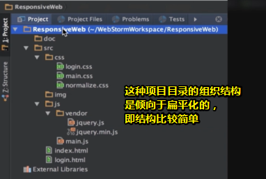

# 第2章 如何组织项目目录结构

## ★讲了什么？

> 介绍了约定优于配置的思想，常见的项目目录和文件的组织方式，一些基本文件的作用等知识，为编码开始做准备。

## ★2-1 简述

### ◇如何组织项目目录结构？

在开始制作页面之前需要做一些准备工作，其中比较重要的，就是**确定项目目录和文件的组织结构**。

一个比较规范的结构，有助于多元协作。那么在软件设计方面有一个概念叫做「convention over configuration」，就是**约定优于配置**，也有人把它叫做**按约定编程**。

这个概念，其中有重要的一环就是**约定代码结构和命名规范，从而来减少配置的数量**！

举个例子来说，我们约定所有的样式文件都要放到名称叫做`CSS`的文件夹下，那么我们在编写代码的时候就可以很自信的相信——如果一个文件夹的名字叫做`style`或者`js`之类的，那么它们下面一定不会有样式文件。

再举个例子，如果我们规定所有的脚本文件，它们压缩以后，**命名方式**都是在原先的文件名后面加上 `.min` 。这样约定后，当我们要发布的时候，只需要通过**自动化**的方式，简单地将所有引用脚本，它们的文件路径都加上 `.min` ，就可以保证线上环境引用的脚本代码都是经过压缩的。**✎：**

那么如果我们没有这样的约定呢？

也许张三喜欢加上`min`，李四喜欢加上`compress`等等，那么对于这些脚本我们就只能一个去检查。当然**关于发布不仅仅就是这么简单**，后面章节会涉及到更多打包发布的内容，接下来我们会再详细的讲解。

### ◇听说张三的组织方式棒棒哒？

接着我会介绍一种简单的项目文件和目录的组织方式。

在介绍之前，大家首先需要了解的就是——其实**没有最好的组织方式，每个人和每个团队都有自己的习惯**。

比如有的人喜欢把样式文件放在`css`的文件夹下，有的人就喜欢放到`style`文件夹下，有的人喜欢用简写命名文件夹，比如说`img`，那么有的人就喜欢用全称，比如`image`，有的人喜欢用单数，比如`image`，有的人喜欢用复数加个`s`。这些其实根本没有好坏、对错之分，也就是说**只有合适的、适合的就是最好的。**那么言归正传，我们来一起一步一步地把项目的基本结构搭建起来吧！**✎：**

## ★2-2 文件夹的组织

### ◇较小的项目

#### 根目录

- ResponsiveWeb——项目的名字
  - src——所有的项目源代码文件都会放在这个文件夹下
  - doc——doc文件夹用来放置项目的相关文档，比如一些需求文档、原型文档、设计图等等
  - dist——可选（看项目是否需要），dist文件夹用于存放处理后的发布文件
  - test——可选（同上），test文件夹用于存放测试文件

注意，这里我们的文件夹它们的名称都是用简写的单数的形式，所以为了保持一致性，在这些文件夹下建立子文件夹时也要注意使用这种形式，也就是简写的，尽量来简化单词的拼写，然后使用单数！所以，可有，**✎：**

#### 子目录和子文件

- ResponsiveWeb
  - doc
  - src
    - css——存放样式文件
    - img——存放图片
    - js——存放脚本文件
    - index.html——作为网站的首页，如果我们有其它的页面的话，也直接和index这个页面建立在一起，如下面这个login.html
    - login.html

ps：在创建文件的时候，可以生成一个空文件，也可以根据模板来创建！而这个模板，等会儿会说到整个HTML代码的书写！

言归正传，你会发现目前所有的页面都放在最顶级，即源代码（src目录）下面的最顶级，而且不区分文件夹来放置，都是在一个文件夹里并列放置。

#### css目录

以下是样式文件的组织姿势，**✎：**

- css
  - main.css——通用的样式文件，它在每个html页面中都会被进行引用
  - normalize.css——css reset文件，关于什么是css reset？后面介绍样式部分的时候我们会说到！
  - login.css——个性化的样式

如果某个页面有一些个性化的样式，也就是说只有自己这个页面才使用的样式，我们可以有两种处理方式，**✎：**

一种是直接放在main.css中，这种处理方式是和整个网站风格比较统一、个性化的样式不是很多的情况。

还有一种方式我们可以单独建立一个样式文件，比如说在这个login页面，也叫登录页面，它有一个样式需要应用，但这个样式只是在登录页面去应用，那么可以和页面取相同的名称建立一个样式文件。比如说它就叫login.css。

两种方式各有利弊，如果**个性化的内容比较多**的话，就**单独建立一个样式文件**比较稳妥；那么如果**比较少**的话，就可以**直接放在main.css**中，这样以后，那么我们**网站上线以后，请求也会比较少**。

#### js目录

关于脚本文件的组织和样式文件比较类似。

通用的脚本文件，我们可以把它命名main.js。那么个性化的脚本处理，可以参考样式文件的组织方式。

#### vendor目录

在使用脚本的时候，很多情况我们会引用到第三方的一些库、框架什么的。

对于第三方的脚本文件，我们**在js文件夹下建立一个叫做vendor的文件夹**。这个子文件夹它可以**存放一些第三方的一些库或者框架**。比如说jQuery，在这里存放的时候可以存放开发版、非压缩版。

非压缩版我们就直接用库的名字来命名（jquery.js），也可以存放压缩后的发布版。而压缩后的发布版，一般我们以`.min.js`这样来命名，如jquery.min.js。这样一眼就可以看出来，这个jquery.js是用于平时开发用的，它是不压缩的，带有注释的。而jquery.min.js则是压缩过的，至于带不带版本号都可以，这根据大家的习惯即可。

注意，在这里，其实可以看到我们的结构风格是倾向于**扁平化**的，也就是**结构比较简单**。**✎：**

对于比较小的项目来说，这种结构已经足够了，像**我们的项目作为一个教学的演示项目完全已经足够**了。

### ◇比较大的项目

在有的比较大的项目中，可能会采用不同的组织方式。我举个例子来说，如作为演示，新建一个`othersrc`的目录，这是另一种、另一个项目，它的另一种组织方式，**每一个子功能都会相应地建立一个子文件夹**。**✎：**

- othersrc
  - home
  - login
  - customer
  - common
  - ……

比如首页会建立一个home的文件夹，登录会建一个login文件夹，其它的比如说有「一些用户模块——会建立一个用户（customer）的文件夹」、一些通用的则会建立一个比如说叫common这样一个文件夹，common用来存放通用的样式、脚本和图片等等。还有其它的一些个性化的都分开来存放，有点类似于这样，**✎：**

每个子文件夹都有点像一个小小的项目，微型小项目。

common里边存放了所有这些模块（如home、login等）都需要的，或者有可能需要的一些组件、一些通用的样式、一些通用的脚本、通用的图片，那么每一个里边又分开来存放。

如果**组件比较多**的话，有可能另外一种命名方式会把这些组件分别建立一个目录来存放。比如说这样的，如建立一个叫component的这样一个文件夹，在这个文件夹里边有很多的组件，比如说它们有alert、比如说grid，比如说tabpanel等等。而每个组件又包含自己的样式、自己的图片、自己的js，总之这也是一种组织目录、组织文件的一种方式。**✎：**

当然了，如果你使用到了其它的技术，有可能实际的目录会比现在这里的多很多，比如说不光有css、img、js这几个文件夹，有可能你会有`tpl`文件夹用来存放模板文件，有可能有`swf`文件夹，用来存放一些flash文件。

如果你的css不是用原生的来写，比如说用一些工具less或者sass等等，有可能还会有这样的一些类似的文件夹（（如less、sass）），它们用来存放less或者sass等编写的一些样式文件，最后生成的话有可能会生成到css文件夹下。**✎：**

### ◇小结

刚才说的几种，都是可以用的一些、也是比较推荐的一些目录和文件的组织方式，比较大的项目可以采取上面的，**✎：**

对于一些中小型项目下面就足够了，大家只需要根据实际的项目需要来进行选择就可以了。

## ★2-3 有用的文件1（robots.txt、favicon.ico、humans.txt）

## ★2-4 有用的文件2（.editorconfig、gitignore）

## ★2-5 有用的文件3（LICENSE.txt、README.md、CHANGELOG.md）

## ★2-6 有用的文件4（markdown）

## ★小结

- 关于如何组织项目目录结构，有这么一个说法就是「约定优于配置」，如约定这个目录应该叫啥，这个文件的压缩版应该叫啥，当然这只是对命名的约定！还有其它的约定呢！

  给一个简单的目录命名吧！——样式就用`css`好了，图片就`img`吧 ！脚本那就`js`……

  之前看视频写的一个项目的目录结构，**✎：**

  **➹：**[ppambler/163-music-2018: 163-music-demo](https://github.com/ppambler/163-music-2018)

- 项目目录的命名，可以用简写、单数的姿势。项目目录的组织结构视项目大或者中小型决定，总之我猜在一个项目组里，这应该会有规范文档吧！

## ★Q&A

### ①约定优于配置？

**➹：** [约定优于配置 - 维基百科，自由的百科全书](https://zh.wikipedia.org/wiki/%E7%BA%A6%E5%AE%9A%E4%BC%98%E4%BA%8E%E9%85%8D%E7%BD%AE)

> **约定优于配置**（**convention over configuration**）[[1\]](https://zh.wikipedia.org/wiki/%E7%BA%A6%E5%AE%9A%E4%BC%98%E4%BA%8E%E9%85%8D%E7%BD%AE#cite_note-1)，也称作**按约定编程**[[2\]](https://zh.wikipedia.org/wiki/%E7%BA%A6%E5%AE%9A%E4%BC%98%E4%BA%8E%E9%85%8D%E7%BD%AE#cite_note-2)，是一种软件[设计范式](https://zh.wikipedia.org/w/index.php?title=%E8%AE%BE%E8%AE%A1%E8%8C%83%E5%BC%8F&action=edit&redlink=1)，旨在减少[软件开发人员](https://zh.wikipedia.org/wiki/%E8%BD%AF%E4%BB%B6%E8%AE%BE%E8%AE%A1%E5%B8%88)需做决定的数量，获得简单的好处，而又不失灵活性。
>
> 本质是说，开发人员仅需规定应用中不符约定的部分。

总之，**✎：**

> 如果您所用工具的约定与你的期待相符，便可省去配置；反之，你可以配置来达到你所期待的方式。

**➹：**[如何评价“约定优于配置”的程序语言? - 知乎](https://www.zhihu.com/question/47239663)

**➹：**[什么是约定优于配置？ - 知乎](https://www.zhihu.com/question/62960377)

看了这个答案，**✎：**

**➹：**[什么是约定优于配置？ - RMC Yang的回答 - 知乎](https://www.zhihu.com/question/62960377/answer/360959520)

其中说到，**✎：**

> 代码逻辑远比配置文件更容易debug。配置文件更像是declarative programming ，而程序逻辑是imperative programming. 在衍生对比，你可以想象一下写html和写JavaScript 的区别

我关注点在于HTML和JavaScript，这个声明式和命令式的对比真得很意思啊！我怎么就没有想到呢？前者语义化标签，我要个一级标题h1，我要个段落p等等……而后者则是一步步来操作DOM等……与此同时，联想到Vue的声明式渲染，你就会觉得JavaScript不需要做什么东西就能很好地操作DOM了……

对了，关于配置文件，**✎：**

> 通常，一个Web App在运行时都需要读取配置文件，比如数据库的用户名、口令等，在不同的环境中运行时，Web App可以通过读取不同的配置文件来获得正确的配置。

**➹：**[Day 6 - 编写配置文件 - 廖雪峰的官方网站](https://www.liaoxuefeng.com/wiki/0014316089557264a6b348958f449949df42a6d3a2e542c000/001432339034336cbf72acd43354d72831461e3871d9f2e000)

听说webpack的配置文件经常让开发者头疼，也有人说webpack将会被0配置的parcel给取代掉！

老实说，我还是不太懂约定优于配置的「配置」指的是什么？我在想把配置里的东西也约定好了，那么这里的「优于」应该不是指要了约定就不要配置吧！

**➹：**[约定优于配置——软件开发的简约原则 – 尘埃落定](https://www.lovelucy.info/convention-over-configuration.html)

我继续看了这篇文章，难道配置指的是if……else……？或者说这里的配置指的就是不遵循规范，任性而为？而不是我想象中的配置文件——即我想象中的配置文件似乎也是一种约定。

那么Vue框架呢？它也是约定优于配置咯！或者说这所谓的语法本质上来说也是一种约定咯？

言而总之，我能否认为配置是相对于约定来说的！或者说配置是一个人的约定……

也就是说，**✎：**

> 「配置」是一个人的约定，而「约定」是大家都认可的约定……
>
> 一个任性自由，一个大家好才是真得好……

:joy::joy::joy:

ps：难到配置和配置文件是两回事？这里约定优于配置的「配置」指的应该是自己动手去做的东西，比如命名方面的（如文件、目录、变量、函数……）等等一些方面的内容！而配置文件真得 就只是配置文件而已，在我看来配置文件本省也是一种约定！或者我可以认为配置文件是声明式的，而配置（自己主动实现的过程）是命令式的，也叫过程式！总之就是创造约定的「萌芽」，当大部分人的认定后，自己动手配置才会成为约定，就像是萌芽成长为一棵大树……

### ②关于扁平化的目录结构？

**➹：**[网站内部优化：扁平化目录结构_百度经验](https://jingyan.baidu.com/article/656db91880be75e381249cdc.html)

**➹：**[个人博客 SEO 优化（2）：站内优化 - 超人前端之路 - SegmentFault 思否](https://segmentfault.com/a/1190000014419448)

视频中讲到，就是一种结构比较简单的目录结构！

老实说，这个扁平化我是不理解，包括目前也是如此，如什么扁平式设计、扁平式管理等等

如果按照「简单」来理解的话，倒不如说这是一种化繁为简的姿势！总之就是麻雀虽小，五脏俱全！

简而言之就是，在保证质量的同时又降低了成本！

**➹：**[容易被误解的扁平化管理 - 简书](https://www.jianshu.com/p/893fc5369de4)

